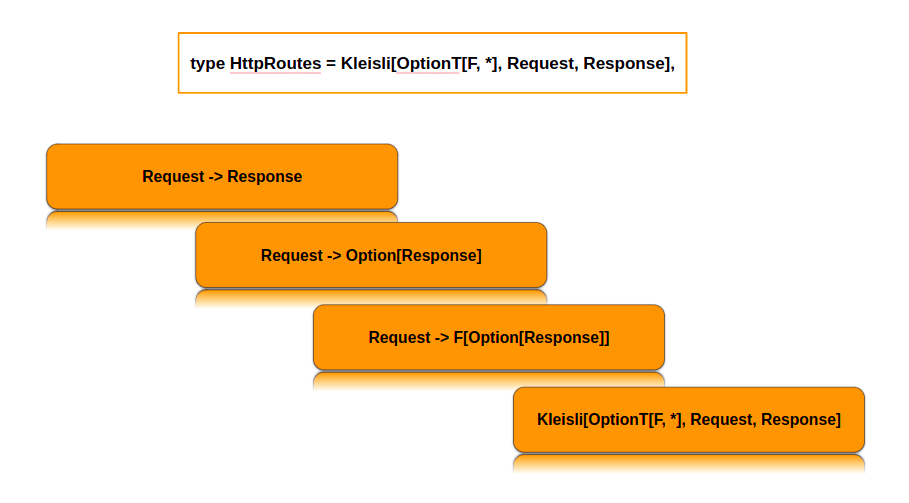

# HTTP4s

## What is http4s?

*Typeful, functional, streaming HTTP for Scala*

### Typeful
http4s servers and clients share an immutable model
of requests and responses. Standard headers are 
modeled as semantic types, and entity codecs are 
done by typeclass.

### Functional
The pure functional side of Scala is favored to 
promote composability and easy reasoning about your
code. I/O is managed through cats-effect.

### Streaming
http4s is built on FS2, a streaming library that 
provides for processing and emitting large payloads
in constant space and implementing websockets.

## HttpRoutes[F] – Heart of http4s
The http4s library is based on the concepts of 
Request and Response. A request is mapped to a 
response through a set of function of type `Request
=> Response`. These functions are routes, and a 
server is set of such routes. Without getting into 
a a lot of details, consider the following points:

1. Producing a response from a request requires some
side-effects, like interaction with database, with 
external services, etc. This transforms our original
route function to `Request => F[Reponse]`
2. Not every request has a response, hence the type
of the function can be tranlsated to `Request => 
F[Option[Response] => OptionT[F, Response]` (monad 
transformer)
3. Cats Kleisli monad transformer `Kleisli[F[_], A,
B]` is a wrapper around function `A => F[B]`, thus 
transforming our route function to 
4. `Kleisli[OptionT[F, *], Request, Response]`

Finally, the http4s library defines a type alias for
the Kleisli monad transformer that is easier to 
understand for human beings: `HttpRoutes[F]`



### Creating endpoint
We can create a simple route type, its endpoint and
behaviour using http4s as follows:

```scala
val route: HttpRoutes[IO] = HttpRoutes.of[IO] {
  case GET -> Root / "hello" / name => Ok(s"""Hello, ${name}!""")
}
```
This can be represented diagrammatically as:


## Testing the endpoint
One beautiful thing about the `HttpRoutes[F]` model 
is that we don’t need a server to test our route. 
We can construct our own request and experiment 
directly in the REPL. For the above endpoint, we
need to create a `Request` and a `Response` wrapped 
in `IO` for testing.


## References
* https://github.com/http4s/http4s